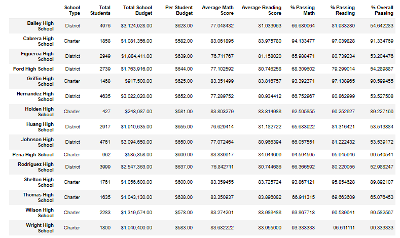

# School District Analysis

## Overview of the School District Analysis
The strength of an education system and the resources it has are essential for student success. City school districts are responsible for analyzing data, at the student and school level, from multiple sources and in various formats, which ultimately provide insight on how well students are performing, the size of school budgets and overall priorities. For the School District Analysis project, student’s math and reading scores will be analyzed, along with information on the schools they attend. By aggregating this data, trends on school performance can be identified and utilized to implement strategic decisions at the school and district level.

## Purpose
The purpose of this project is to evaluate the math and reading grades for Thomas High School students. A key dataset utilized in evaluating the analysis, indicates that there is evidence of academic dishonesty, as the grades for ninth grade students appear to have been altered. In an effort to uphold state-testing standards, a comparative analysis will be completed which will indicate whether replacing math and reading scores for Thomas High School ninth grade students with NaNs, which means ‘not a number’ and cannot be equal, will affect the overall analysis.

## Resources Utilized to Complete Analysis
CSV Files: schools_complete.csv, students_complete.csv, clean_students_complete.csv
Jupyter Notebook Files: PyCitySchools.ipynb, PyCitySchools_Challenge.ipynb
## Results
The questions below address the results of the comparative analysis.

## ** How is the district summary affected?** 
The district summary comparison shows that the main difference between the initial and updated analysis is that the average math score decreased by 0.1% and the percent of students who passed math decreased by 0.2%. The average reading score remained the same, but the percent of students who passed reading decreased by 0.3%. The overall percent of students who passed only varied by 0.1%.

**District Summary Comparison

## * How is the school summary affected?
The school summary indicates that Thomas High School was the only school whose scores were affected. There was a slight variance with the average math and reading scores, however the most significant changes in the data were with respect to the percentage of students who passed math and reading. The initial analysis shows that the percentage of Thomas Jefferson Students who passed math dropped from 93.272171% down to 66.911315% and the percentage who passed reading also dropped from 97.308869% to 69.663609%.

* **Initial Analysis**

* **Updated Analysis**

* **How does replacing the ninth graders’ math and reading scores affect Thomas High School’s performance relative to the other schools?**
By replacing the ninth graders' math and reading scores, Thomas High School's performance ranking dropped from having the second highest percentage of overall students passing (90.94801%) down to having the eighth lowest percentage of overall students passing (65.07645%), in the district.

* **How does replacing the ninth-grade scores affect the following:**

* **Math and Reading Scores by Grade:** Ninth grade math and reading scores dropped, when the scores were replaced to reflect NaN in the dataset.
* **Scores by School Spending:** The spending range of $630 - $644 per student, at Thomas High School, remained the same. However, the percentage of overall students passing dropped from 79% to 63%, within that spending range.

Scores by School Size: Thomas High School is a medium sized school, that falls within the 1000 - 2000 bracket of school size. Average math and reading scores within this bracket remained the same, however the percentage of students passing math and reading, both dropped by 6%. As such, schools within the medium school size bracket experienced a drop in percentage of overall students passing by 6%.

Scores by School Type: Charter schools consistently performed better than District schools. Although, replacing the ninth-grade scores did not have an impact on the average or percentage of passing math and reading scores, the percentage of overall students passing dropped by 20% for District Schools.

## Summary
By conducting the comparative analysis, four major changes are evident in the updated school district analysis after reading and math scores for ninth grade Thomas High School students were replaced with NaNs.

* Utilizing NaN is an effective way to capture inconsistencies in a dataset, without skewing the data by having to enter zeros in place of the inconsistency.
* School spending ranges per student do not impact math and reading scores.
* School size has an impact on testing scores. The larger the school size, the lower the test scores and percentage of overall students passing.
* Charter Schools performance is stronger than those of District Schools, as they have higher testing scores and percentages of overall students passing.
